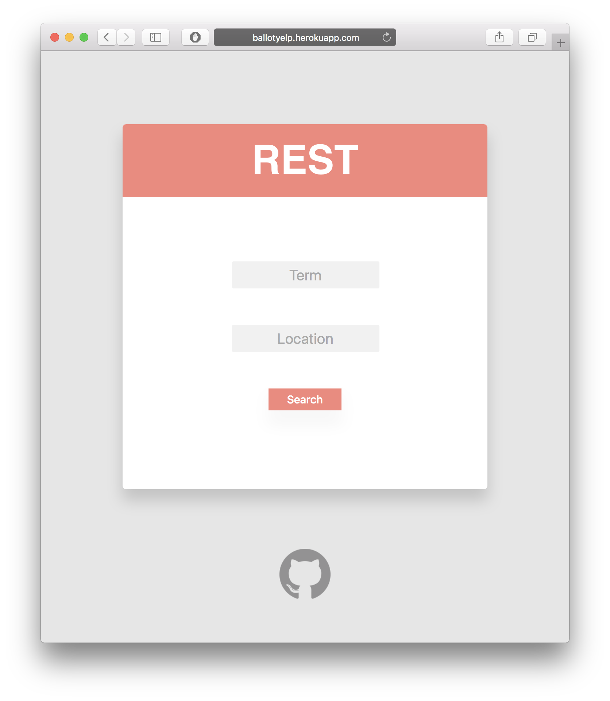

# yelpREST
An API built with Express, used to pull information from Yelp to be used in a web application.

###### The main purpose for this is to ease the process of authenticating through OAuth for testing purposes!

###### The key token is provided, for now.

## Build Locally
To create a server of your own, using your own access token, simply replace the token and run the following commands:

`npm install` will gather all of the required modules such as `Express` `Axios` and `yelp-fusion`

`node server` will run the server at localhost:5000 by default to support Heroku's default port requirement.

## Accessing the API with a UI (UI is in-progress)
To use the API that has already been deployed on Heroku, make request with an interface at: 

#### https://ballotyelp.herokuapp.com
  
## Accessing with URL Queries
To make requests to the API inside of web application, make a GET request to the base URL
`:term` is the search term. Basically anything is valid, such as `burgers` `tacos` or even `starbucks`
`:location` is the location, such as (Boston, Calabasas, etc.)

#### https://ballotyelp.herokuapp.com/yelpsearch/:term/:location

### Accessing with Coordinates

This one's pretty straight forward, don't mix them up!
#### https://ballotyelp.herokuapp.com/yelpsearch/:searchTerm/:longitude/:latitude

